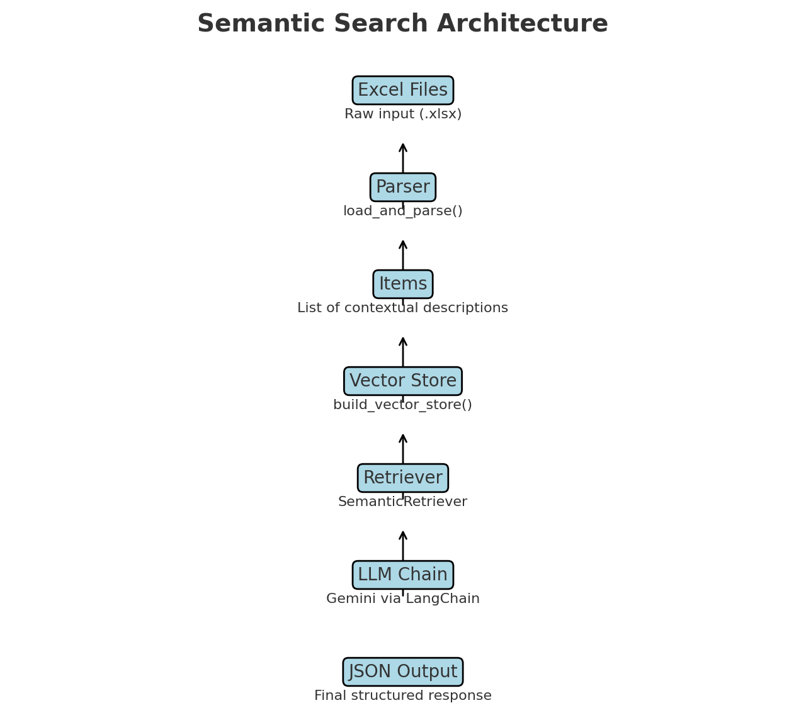

````markdown
# 📊 Semantic Search for Spreadsheets

This project delivers a **semantic search engine** for Excel workbooks, transforming raw formulas into business‑readable insights. Users pose natural‑language queries like:

> “Show percentage calculations”  
> “Find all revenue formulas”  
> “Where are my cost-related metrics?”

and receive structured JSON responses with detailed explanations of each matching formula.

---

## 🧩 Code Components & Parameter Reference

A concise overview of the key functions, their inputs, outputs, and side effects—as implemented in `sheet-semantic.ipynb`:

### `load_and_parse(paths: List[str]) -> List[Dict[str, Any]]`

- **Inputs**: `paths` – list of spreadsheet file paths.
- **Side Effects**:
  - Populates global maps:
    - `label_map` (non‑formula cell labels)
    - `formula_map` (raw formula strings)
    - `workbook_raw_map` (openpyxl Workbook with formulas)
    - `workbook_val_map` (openpyxl Workbook with evaluated values)
- **Returns**: `items` – a list of dicts, each containing:
  - `path`, `sheet`, `cell`, `concept`, `formula`, `row_header`, `col_header`, `row_header_col_header`, `description`

### `build_vector_store(items: List[Dict[str, Any]]) -> FAISS`

- **Inputs**: `items` – as returned by `load_and_parse()`
- **Operations**:
  - Extracts `description` texts and corresponding metadata
  - Calls `FAISS.from_texts(texts, embeddings, metadatas=metas)`
- **Output**: prints `Vector store contains {len(texts)} entries.`
- **Returns**: a `FAISS` instance with embedded vectors and metadata

### `resolve_reference(path: str, sheet: str, coord: str) -> str`

- **Purpose**: Convert a cell coordinate into its human-readable label or semantic sub-formula.
- **Logic**:
  1. If present in `formula_map`, returns a wrapped `make_semantic_formula()` call
  2. If present in `label_map`, returns the stored label
  3. Checks left or above neighboring cells for text labels
  4. Falls back to row/column headers via `get_row_header()` / `get_col_header()`
  5. Finally, returns the raw value from `workbook_val_map` or `""`

### `make_semantic_formula(path: str, raw: str, sheet_ctx: str) -> str`

- **Inputs**:
  - `path`: workbook path
  - `raw`: original formula string (e.g. `="Forecast"!B2*0.2`)
  - `sheet_ctx`: current sheet name
- **Process**:
  - Removes `$` signs
  - First replaces **cross-sheet** references via regex + `resolve_reference`
  - Then replaces **same-sheet** references similarly
- **Returns**: a string of the semantic formula, stripped of leading `=`

### `SemanticRetriever.get_relevant_documents(query: str) -> List[Document]`

- **Description**: Wraps FAISS similarity search to produce semantically enriched `Document` objects.
- **Steps**:
  1. Calls `store.similarity_search(query, k=self.k)`
  2. For each result, uses `make_semantic_formula()` to build a human‑friendly formula
  3. Constructs `Document(page_content, metadata)` for LangChain

### LLM Chain Construction

- **Prompt Template**: `ChatPromptTemplate.from_messages([...])` defines a strict JSON schema with six fields.
- **Document Chain**: `create_stuff_documents_chain(llm=llm, prompt=chat_prompt)`
- **Retrieval QA Chain**: `create_retrieval_chain(retriever=retriever, combine_docs_chain=doc_chain)`

### Execution Flow

1. Define `workbook_paths` and call `load_and_parse(workbook_paths)`
2. Build the FAISS index via `build_vector_store(items)`
3. Instantiate `SemanticRetriever(store=vector_store, k=5)`
4. Assemble the QA chain (`doc_chain`, `qa_chain`)
5. Invoke `qa_chain.invoke({"input": query})` to get `json_answer`

---

## 📖 Design Document

A concise technical narrative covering the core design pillars and the rationale behind implementation decisions.

### 1️⃣ Approach to Semantic Understanding

We treat spreadsheet cells not as isolated coordinates but as **semantic units** carrying business meaning.

- **Header-based Concept Inference**: For each formula cell, we extract its row header, column header, and top‑level section label to infer a human concept (e.g. “Gross Margin (Yr1)”).
- **Reference Resolution**: Using `resolve_reference()`, raw cell references (e.g. `B5`) are replaced with neighboring labels or header text, enabling phrases like “Revenue” or “Cost of Goods Sold.”
- **Formula Expansion**: `make_semantic_formula()` recursively replaces both cross‑sheet and same‑sheet references with resolved labels, producing a semantic string that retains the calculation logic without Excel syntax.

### 2️⃣ Handling Business Domain Knowledge

Rather than hard‑coding every financial term, we leverage spreadsheet structure and LLM capabilities:

- **Dynamic Label Mapping**: `label_map` automatically captures any non‑formula text adjacent to formulas, providing contextual names without a predefined dictionary.
- **Formula Retention**: `formula_map` holds the exact Excel formula, ensuring no loss of computational intent.
- **Value Back‑up**: `workbook_val_map` stores evaluated cell values; used as a fallback when no label or header is available.

This blend of structural parsing and LLM understanding allows the system to work across domains without manual term lists.

### 3️⃣ Query Processing & Result Ranking Methodology

1. **Query Ingestion & Expansion**: The user query is passed to Gemini, which enriches it with synonyms and related terms.
2. **Vector Similarity Search**: We embed every item’s `description` via MiniLM and index in FAISS. At query time, the expanded query is embedded and compared via cosine similarity to retrieve the top‑k most relevant entries.
3. **Ranking Enhancements**: Results are implicitly ranked by vector score. Further refinements include:
   - **Sheet Priority**: Prioritize key sheets (e.g. P&L Statement).
   - **Formula Complexity**: Weight multi‑step calculations more heavily.
   - **Context Depth**: Favor items with richer header context.
4. **LLM Interpretation**: The top results plus metadata are passed to a strict JSON prompt that instructs Gemini to output six fields—Concept Name, Location, Formula, Value, Explanation, Business Context—ensuring consistent, parseable output.

### 4️⃣ Technical Architecture & Data Structures



```mermaid
flowchart LR
  subgraph Ingestion
    A[📊 Excel Files] --> B[🧩 load_and_parse()]
  end
  subgraph Indexing
    B --> C[🧠 items list with context]
    C --> D[🧮 build_vector_store()]
  end
  subgraph Retrieval
    D --> E[🔍 SemanticRetriever]
  end
  subgraph Interpretation
    E --> F[🧾 QA Chain] --> G[💬 JSON Response]
  end
```
````

- **Global Maps**:
  - `label_map: Dict[str, str]` — maps `"path|sheet!cell"` to header/label text.
  - `formula_map: Dict[str, str]` — stores raw formulas.
  - `workbook_raw_map` / `workbook_val_map` — hold raw and data‑only workbooks for reference resolution.
- **Items**: A list of dicts capturing path, sheet, cell, concept, formula, headers, and a combined `description` string used for embedding.

### 5️⃣ Performance Considerations & Trade‑Offs

- **Embedding Caching**: Generating embeddings once per workbook load reduces network calls and latency.
- **Selective Indexing**: Only cells with formulas are indexed, minimizing FAISS memory footprint.
- **Batch LLM Usage**: Top‑k results are combined into a single prompt to Gemini, reducing round‑trip delays.
- **Parallel Parsing**: For large workbooks, parsing sheets concurrently accelerates initial indexing.

### 6️⃣ Challenges Faced & Solutions Implemented

Each challenge is described alongside the thought process and precise code changes:

> **Limited Reference Scope (Same‑Sheet Only)**
>
> - **Context:** Early `resolve_reference()` handled only same‑sheet cell references (e.g. `A1`), so cross‑sheet formulas like `='Forecast'!B2` were unresolved.
> - **Insight:** Realized that true workbook semantics span across tabs and require separate detection.
> - **Code Change:** In `make_semantic_formula()`, I inserted a **cross‑sheet regex pass** prior to same‑sheet logic:
>   ```python
>   for m in re.finditer(r"'([^']+)'!([A-Z]+\d+)|([A-Za-z0-9_]+)!([A-Z]+\d+)", sem):
>       … resolve_reference(path, sheet_name, cell)
>   ```
>   This guarantees multi‑tab references are captured and replaced correctly.

> **Loss of Calculation Steps (Hard‑Coded Values)**
>
> - **Context:** Recursive expansion sometimes returned final numeric values instead of the chain of operations.
> - **Insight:** Needed to preserve operators and structure while substituting only cell refs.
> - **Code Change:** Stored raw formulas in `formula_map[key]`. In `load_and_parse()`, each `item["description"]` uses that raw `val`, and `make_semantic_formula()` replaces only references, leaving operators intact.

> **Missing Header Context in Embeddings**
>
> - **Context:** FAISS vectors built on `=B5/B6` lacked clarity, leading to poor semantic matches.
> - **Insight:** Embeddings must include human‑readable context (row, column, section headers).
> - **Code Change:** Enhanced the `description` in each `items.append({...})` to include `row_header`, `col_header`, and `row_header_col_header`:
>   ```python
>   items.append({ … "description": f"{concept} (sheet={sheet}, cell={cell.coordinate}; row_header={row_hdr}, col_header={col_hdr}, row_header_col_header={row_hdr_col_hdr}): {val}" })
>   ```
>   Vectors now reflect full semantic context.

> **Enforcing Structured JSON‑Only LLM Output**
>
> - **Context:** Early Gemini prompts returned narrative answers, breaking downstream JSON parsing.
> - **Insight:** A strict schema is needed.
> - **Code Change:** Defined a precise `ChatPromptTemplate` listing the six JSON fields and generated responses via `create_stuff_documents_chain()`, which enforces the schema.

---

## 📈 Example Output Payload

```json
{
  {
  "margin_calculations": [
    {
      "Concept Name": "Income Tax (20%)",
      "Location": "P&L Statement!B20",
      "Formula": "((Revenue minus Cost of Goods Sold) minus Total Operating Expenses minus Operating Profit) minus (((Revenue minus Cost of Goods Sold) minus Total Operating Expenses minus Operating Profit) times 20%)",
      "Formula_Explanation": "First, calculate taxable income by subtracting Cost of Goods Sold, Total Operating Expenses, and Operating Profit from Revenue. Then, calculate the income tax by multiplying the taxable income by the tax rate of 20%. Finally, subtract the calculated income tax from the taxable income to arrive at the final Income Tax amount.",
      "Explanation": "This formula calculates income tax, which involves a percentage (20%).",
      "Business Context": "This calculates the company's income tax expense, a key component of the profit and loss statement."
     },
    ]
  }
}
```

```

```
